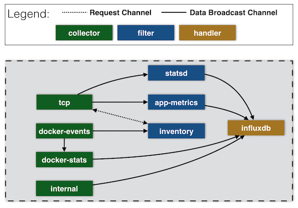

# qframe-metrics
Agent to collect metrics via TCP and docker-stats api




## Example

In order to use the collector, backend services needs to be started.

```bash
$ docker stack deploy -c docker-compose.yml qframe
Creating service qframe_influxdb
Creating service qframe_grafana
$ wait 30 ; docker service ls -f label=com.docker.stack.namespace=qframe
ID                  NAME                     MODE                REPLICAS            IMAGE                             PORTS
75qz44eudaab        qframe_grafana         replicated          1/1                 qnib/plain-grafana4:latest        *:3000->3000/tcp
ho4lim32oism        qframe_influxdb        replicated          1/1                 qnib/plain-influxdb:latest        *:8083->8083/tcp,*:8086->8086/tcp
$
```

The Grafana dashboard can be found under [localhost:3000](http://localhost:3000) (admin/admin).

## Agent & Client


## Development

```bash
$ docker run -ti --name qframe --rm -e SKIP_ENTRYPOINTS=1 \
            -v ${GOPATH}/src/github.com/qnib/qframe/examples/qframe-metrics:/usr/local/src/github.com/qnib/qframe/examples/qframe-metrics \
            -v ${GOPATH}/src/github.com/qnib/qframe-collector-tcp:/usr/local/src/github.com/qnib/qframe-collector-tcp \
            -v ${GOPATH}/src/github.com/qnib/qframe-collector-internal:/usr/local/src/github.com/qnib/qframe-collector-internal \
            -v ${GOPATH}/src/github.com/qnib/qframe-collector-docker-events:/usr/local/src/github.com/qnib/qframe-collector-docker-events \
            -v ${GOPATH}/src/github.com/qnib/qframe-collector-docker-stats:/usr/local/src/github.com/qnib/qframe-collector-docker-stats \
            -v ${GOPATH}/src/github.com/qnib/qframe-filter-docker-stats/lib:/usr/local/src/github.com/qnib/qframe-filter-docker-stats/lib \
            -v ${GOPATH}/src/github.com/qnib/qframe-filter-grok/lib:/usr/local/src/github.com/qnib/qframe-filter-grok/lib \
            -v ${GOPATH}/src/github.com/qnib/qframe-filter-inventory/lib:/usr/local/src/github.com/qnib/qframe-filter-inventory/lib \
            -v ${GOPATH}/src/github.com/qnib/qframe-filter-metrics/lib:/usr/local/src/github.com/qnib/qframe-filter-metrics/lib \
            -v ${GOPATH}/src/github.com/qnib/qframe-filter-statsd/lib:/usr/local/src/github.com/qnib/qframe-filter-statsd/lib \
            -v ${GOPATH}/src/github.com/qnib/qframe-inventory/lib:/usr/local/src/github.com/qnib/qframe-inventory/lib \
            -v ${GOPATH}/src/github.com/qnib/qframe-handler-influxdb/lib:/usr/local/src/github.com/qnib/qframe-handler-influxdb/lib \
            -v ${GOPATH}/src/github.com/qnib/qframe-handler-log/lib:/usr/local/src/github.com/qnib/qframe-handler-log/lib \
            -v ${GOPATH}/src/github.com/qnib/qframe-types:/usr/local/src/github.com/qnib/qframe-types \
            -v ${GOPATH}/src/github.com/qnib/qframe-utils:/usr/local/src/github.com/qnib/qframe-utils \
            -v ${GOPATH}/src/github.com/qnib/statsdaemon/lib:/usr/local/src/github.com/qnib/statsdaemon/lib \
            -v /var/run/docker.sock:/var/run/docker.sock \
            -v $(pwd)/resources/patterns/:/etc/gcollect/patterns/ \
            -w /usr/local/src/github.com/qnib/qframe/examples/qframe-metrics \
            qnib/uplain-golang bash
$ govendor update github.com/qnib/qframe-collector-docker-events/lib \
                  github.com/qnib/qframe-collector-docker-stats/lib \
                  github.com/qnib/qframe-collector-tcp/lib \
                  github.com/qnib/qframe-collector-internal/lib \
                  github.com/qnib/qframe-filter-docker-stats/lib \
                  github.com/qnib/qframe-filter-grok/lib \
                  github.com/qnib/qframe-filter-metrics/lib \
                  github.com/qnib/qframe-filter-inventory/lib \
                  github.com/qnib/qframe-filter-statsd/lib \
                  github.com/qnib/qframe-inventory/lib \
                  github.com/qnib/qframe-handler-influxdb/lib \
                  github.com/qnib/qframe-handler-log/lib \
                  github.com/qnib/statsdaemon/lib \
                  github.com/qnib/qframe-types \
                  github.com/qnib/qframe-utils
$ govendor fetch -v +m
```
