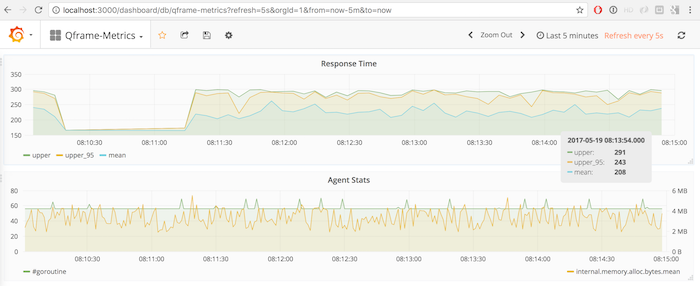

# qframe-metrics
Agent to collect metrics via TCP and docker-stats api


## Example

In order to use the collector, backend services needs to be started.

```bash
$ docker stack deploy -c docker-compose.yml qframe
Creating service qframe_influxdb
Creating service qframe_grafana
$ wait 30 ; docker service ls -f label=com.docker.stack.namespace=qframe
ID                  NAME                     MODE                REPLICAS            IMAGE                             PORTS
75qz44eudaab        qframe_grafana         replicated          1/1                 qnib/plain-grafana4:latest        *:3000->3000/tcp
ho4lim32oism        qframe_influxdb        replicated          1/1                 qnib/plain-influxdb:latest        *:8083->8083/tcp,*:8086->8086/tcp
$
```

The Grafana dashboard can be found under [localhost:3000](http://localhost:3000) (admin/admin).

## Agent & Client

A second docker-compose file includes an instance of the metrics agent and a client to push exemplary data towards the system.

```bash
$ docker stack deploy -c complete-stack.yml qframe 
Updating service qframe_influxdb (id: ync5ictl69gty9mgfo0vktoro)
Updating service qframe_grafana (id: o3wudq9iuw50p5sxqu0xp9837)
Creating service qframe_metrics
Creating service qframe_client
$
```

```bash
$ docker logs -f  $(docker ps -qlf label=com.docker.swarm.service.name=qframe_metrics)
[II] qnib/init-plain script v0.4.21
> execute entrypoint '/opt/qnib/entry/00-logging.sh'
> execute entrypoint '/opt/qnib/entry/10-docker-secrets.env'
[II] No /run/secrets directory, skip step
> execute entrypoint '/opt/qnib/entry/10-qframe-config.sh'
> execute CMD 'qframe-metrics --config /etc/qframe.yml'
2017/05/19 05:54:23 [II] Start Version: 0.0.0
2017/05/19 05:54:23 [II] Use config file: /etc/qframe.yml
2017/05/19 05:54:23 [II] Dispatch broadcast for Back, Data and Tick
2017/05/19 05:54:23.893989 [  INFO]        influxdb Name:influxdb   >> Start handler influxdbv0.1.3
2017/05/19 05:54:23.900714 [  INFO]        influxdb Name:influxdb   >> Established connection to 'http://172.17.0.1:8086
2017/05/19 05:54:23.908448 [  INFO]            grok Name:opentsdb   >> Add patterns from directory '/etc/qframe/patterns/'
2017/05/19 05:54:23.914070 [  INFO]     statsdaemon Name:filter.statsd >> Pctls: 90,95,99
2017/05/19 05:54:23.920431 [NOTICE]            grok Name:opentsdb   >> Start grok filter v0.1.10
2017/05/19 05:54:23.921969 [NOTICE]          metric Name:metrics    >> Start plugin v0.2.0
2017/05/19 05:54:23.923181 [NOTICE]    docker-stats Name:container-stats >> Start docker-stats filter v0.1.2
2017/05/19 05:54:23.924195 [  INFO]    docker-stats Name:container-stats >> [docker-stats]
2017/05/19 05:54:23.925171 [NOTICE]       inventory Name:inventory  >> Start inventory v0.1.4
2017/05/19 05:54:23.926132 [NOTICE]             tcp Name:tcp        >> Start collector v0.2.3
2017/05/19 05:54:23.927546 [  INFO]             tcp Name:tcp        >> Listening on 0.0.0.0:11001
2017/05/19 05:54:23.929070 [NOTICE]          statsd Name:statsd     >> Start plugin v0.1.0
2017/05/19 05:54:23.929402 [  INFO]   docker-events Name:docker-events >> Start docker-events collector v0.2.3
2017/05/19 05:54:23.936357 [  INFO]        internal Name:internal   >> Start internal collector v0.1.1
2017/05/19 05:54:23.938044 [  INFO]     statsdaemon Name:filter.statsd >> Statsdaemon ticker: 5000ms
2017/05/19 05:54:23.939654 [  INFO]     statsdaemon Name:filter.statsd >> listening on :8125
2017/05/19 05:54:24.473882 [  INFO]    docker-stats Name:docker-stats >> Connected to 'moby' / v'17.05.0-ce' (SWARM: active)
2017/05/19 05:54:24.475144 [  INFO]    docker-stats Name:docker-stats >> Currently running containers: 3
2017/05/19 05:54:24.483375 [II] Start listener for: 'qframe_metrics.1.iu2zqm48ls533ko5vjxxfhrga' [0cf9143b40986b6b35053d23af9fbf5f8888e561664ce461835554c6e6f2323e]
2017/05/19 05:54:24.483608 [II] Start listener for: 'qframe_influxdb.1.w4zjdq1bpnliesaliqo3j7wg0' [aaa4e24f6f3d7114eabae744b36b120344ebb8e26db44d2cb7cc6820b5222c27]
2017/05/19 05:54:24.483777 [II] Start listener for: 'qframe_grafana.1.chwzcp9zemng1zzltovou1t4w' [9e3dceae0721e107930318ae589dc70a493f4596a89156356209c8ee16b60809]
2017/05/19 05:54:24.721241 [  INFO]   docker-events Name:docker-events >> Connected to 'moby' / v'17.05.0-ce'
```

And by connecting to the client one can send timer data to the StatsD filter.

```bash
$ docker exec -ti -e HOST=qframe_metrics -e DELAY=0.35  \
                       $(docker ps -qlf label=com.docker.swarm.service.name=qframe_client) loop-timer.sh 50 response_ms
Send: response_ms:10686|ms
Send: response_ms:10046|ms
Send: response_ms:11141|ms
Send: response_ms:19277|ms
Send: response_ms:12348|ms
```
An already [prepared dashboard in Grafana](http://localhost:3000/dashboard/db/qframe-metrics?refresh=5s&orgId=1&from=now-5m&to=now) will provide a graph to plot `mean`, `upper` and `upper_p95` (95th percentile): 



## Development

```bash
$ docker run -ti --name qframe --rm -e SKIP_ENTRYPOINTS=1 \
            -v ${GOPATH}/src/github.com/qnib/qframe/examples/qframe-metrics:/usr/local/src/github.com/qnib/qframe/examples/qframe-metrics \
            -v ${GOPATH}/src/github.com/qnib/qframe-collector-tcp:/usr/local/src/github.com/qnib/qframe-collector-tcp \
            -v ${GOPATH}/src/github.com/qnib/qframe-collector-internal:/usr/local/src/github.com/qnib/qframe-collector-internal \
            -v ${GOPATH}/src/github.com/qnib/qframe-collector-docker-events:/usr/local/src/github.com/qnib/qframe-collector-docker-events \
            -v ${GOPATH}/src/github.com/qnib/qframe-collector-docker-stats:/usr/local/src/github.com/qnib/qframe-collector-docker-stats \
            -v ${GOPATH}/src/github.com/qnib/qframe-filter-docker-stats/lib:/usr/local/src/github.com/qnib/qframe-filter-docker-stats/lib \
            -v ${GOPATH}/src/github.com/qnib/qframe-filter-grok/lib:/usr/local/src/github.com/qnib/qframe-filter-grok/lib \
            -v ${GOPATH}/src/github.com/qnib/qframe-filter-inventory/lib:/usr/local/src/github.com/qnib/qframe-filter-inventory/lib \
            -v ${GOPATH}/src/github.com/qnib/qframe-filter-metrics/lib:/usr/local/src/github.com/qnib/qframe-filter-metrics/lib \
            -v ${GOPATH}/src/github.com/qnib/qframe-filter-statsd/lib:/usr/local/src/github.com/qnib/qframe-filter-statsd/lib \
            -v ${GOPATH}/src/github.com/qnib/qframe-inventory/lib:/usr/local/src/github.com/qnib/qframe-inventory/lib \
            -v ${GOPATH}/src/github.com/qnib/qframe-handler-influxdb/lib:/usr/local/src/github.com/qnib/qframe-handler-influxdb/lib \
            -v ${GOPATH}/src/github.com/qnib/qframe-handler-log/lib:/usr/local/src/github.com/qnib/qframe-handler-log/lib \
            -v ${GOPATH}/src/github.com/qnib/qframe-types:/usr/local/src/github.com/qnib/qframe-types \
            -v ${GOPATH}/src/github.com/qnib/qframe-utils:/usr/local/src/github.com/qnib/qframe-utils \
            -v ${GOPATH}/src/github.com/qnib/statsdaemon/lib:/usr/local/src/github.com/qnib/statsdaemon/lib \
            -v /var/run/docker.sock:/var/run/docker.sock \
            -v $(pwd)/resources/patterns/:/etc/gcollect/patterns/ \
            -w /usr/local/src/github.com/qnib/qframe/examples/qframe-metrics \
            qnib/uplain-golang bash
$ govendor update github.com/qnib/qframe-collector-docker-events/lib \
                  github.com/qnib/qframe-collector-docker-stats/lib \
                  github.com/qnib/qframe-collector-tcp/lib \
                  github.com/qnib/qframe-collector-internal/lib \
                  github.com/qnib/qframe-filter-docker-stats/lib \
                  github.com/qnib/qframe-filter-grok/lib \
                  github.com/qnib/qframe-filter-metrics/lib \
                  github.com/qnib/qframe-filter-inventory/lib \
                  github.com/qnib/qframe-filter-statsd/lib \
                  github.com/qnib/qframe-inventory/lib \
                  github.com/qnib/qframe-handler-influxdb/lib \
                  github.com/qnib/qframe-handler-log/lib \
                  github.com/qnib/statsdaemon/lib \
                  github.com/qnib/qframe-types \
                  github.com/qnib/qframe-utils
$ govendor fetch -v +m
```
